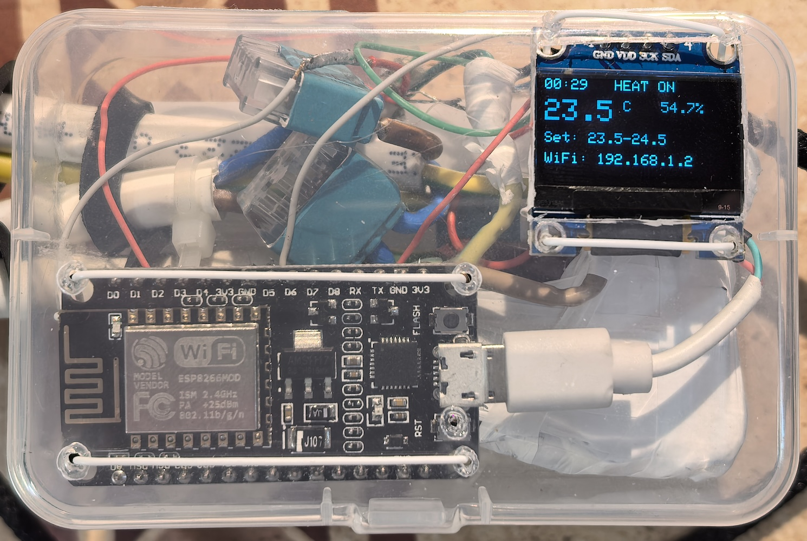
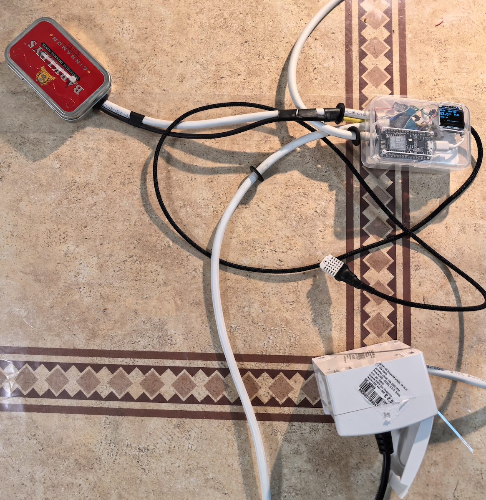
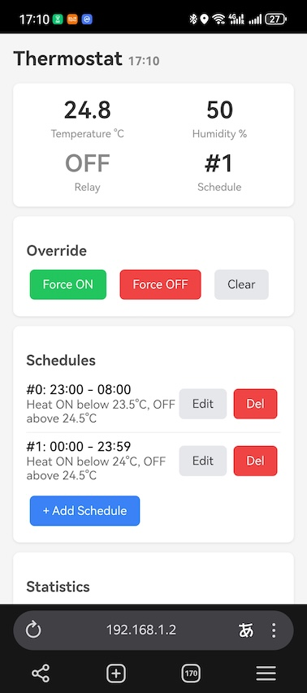

# thermostat

This is a one-day project to create an external thermostat for my dumb room heater.

- Firmware is implemented mostly with Claude code.
- Hardware is made from parts I found in my drawer.
- Packaging is something I found in my kitchen.

You may notice a separate box from mints with a thick wire attached to it: that is an SSR relay.  
I've put it into a separate metal package because it becomes hot even on a 1 kW (5 A) load. I'll probably replace it with a coil relay later for more compact packaging.

See [PROJECT_INFO.md](PROJECT_INFO.md) for details.

## photos

