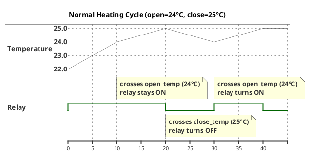
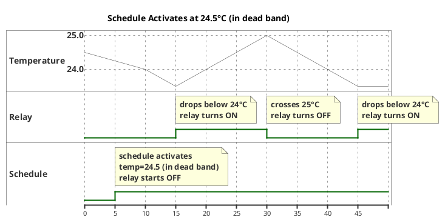
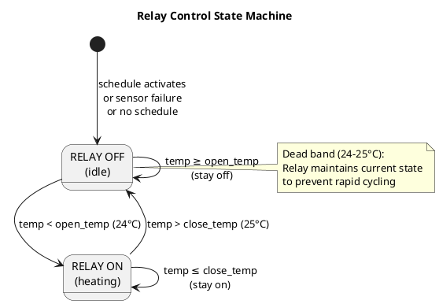

# Thermostat Firmware Requirements

## Hardware Reference
- **MCU**: NodeMCU Amica (ESP8266MOD)
- **Display**: GM009805V4.2 (SSD1306 I2C OLED) - D1/D2
- **Sensor**: AM2302 (DHT22) - D5
- **Relay**: SSR 3-32VDC/220VAC - D6

---

## 1. Heater Relay Control

### Temperature Control Logic
- **Open relay** (heater ON): when temperature < `open_temp`
- **Close relay** (heater OFF): when temperature > `close_temp`
- Hysteresis: `open_temp` < `close_temp` prevents oscillation

### Time-of-Day Limiting
- Relay control only active during configured time windows
- Outside configured windows: relay OFF

### Safety Features
- **Upper temperature limit**: relay OFF when temperature >= 30°C (`UPPER_TEMP_LIMIT`), overrides everything including manual overrides
- **Minimum cycle time**: 2 minutes between relay state changes
- **Sensor failure**: relay OFF (fail-safe)
- **No matching schedule**: relay OFF

### Hysteresis Control Diagrams

Example: `open_temp=24°C`, `close_temp=25°C`

**Scenario 1: Normal heating cycle**



**Scenario 2: Schedule activates at 24.5°C (in dead band)**



**State Machine:**



**Key Behavior:**
- Relay ON when `temp < open_temp`
- Relay OFF when `temp > close_temp`
- Dead band (`open_temp` to `close_temp`): no change, maintains previous state
- On schedule activation in dead band: relay starts OFF, waits for temp < open_temp

### Manual Override
- Network command to force relay ON/OFF
- Optional timed duration in `[[hh:]mm[:ss]]` format (single value = minutes, two parts = hh:mm, three parts = hh:mm:ss)
- Timed override auto-expires after the specified duration
- Indefinite override (no duration) persists until manually cancelled

---

## 2. Display (OLED)

Show on screen:
- Current relay state (ON/OFF, override indicator)
- Current temperature (°C)
- Current humidity (%)
- Current time (HH:MM)
- Active temperature margins (open/close temps), or override countdown when timed override is active
- Connection status (WiFi connected/disconnected, IP address)

---

## 3. Networking

### WiFi
- Connect to AP using stored credentials
- Credentials stored in EEPROM/flash (power-independent)
- Display connection status

### NTP Time Sync
- Sync time on boot
- Configurable timezone (stored in EEPROM)
- Periodic resync (hourly)

### LAN Discovery (UDP Broadcast)
- Listen on designated UDP port
- Respond to broadcast discovery packets
- Response includes: device type, IP address, TCP port

### TCP Command Server
- Text-based protocol over TCP
- Simple request/response format
- Commands detailed in section 6

---

## 4. Configuration

### Wired Setup (USB Serial)
- Configure WiFi SSID and password
- Configure timezone
- Interactive text menu over serial

### Network Setup (TCP Commands)
- Read all state data
- Read/write `temperature_control_setups`
- Manual override control
- No authentication (LAN only)

---

## 5. Temperature Control Setups

### Structure
```
temperature_control_setup {
    time_from: HH:MM
    time_to: HH:MM
    open_temp: float (°C)
    close_temp: float (°C)
}
```

### Behavior
- Multiple setups allowed with non-intersecting time intervals
- First matching setup applies (no intersection validation)
- Stored in EEPROM/flash
- Refreshed every 60 seconds to check for schedule changes

---

## 6. TCP Command Protocol

### Format
```
REQUEST:  COMMAND [ARGS]\n
RESPONSE: OK [DATA]\n  or  ERR [MESSAGE]\n
```

### Commands
| Command | Description |
|---------|-------------|
| `STATUS` | Get all state (temp, humidity, relay, override, upper_limit, schedule, etc.) |
| `GET_SCHEDULES` | List all temperature_control_setups |
| `SET_SCHEDULE idx time_from time_to open close` | Set schedule at index |
| `DEL_SCHEDULE idx` | Delete schedule at index |
| `OVERRIDE ON\|OFF [duration]` | Manual relay override (optional duration in `[[hh:]mm[:ss]]` format) |
| `OVERRIDE CLEAR` | Cancel active override |
| `GET_CONFIG` | Get current WiFi SSID, timezone, IP |

---

## 7. Power-On Sequence

1. Initialize display, show "Booting..."
2. Load WiFi credentials from EEPROM
3. Display "Connecting WiFi..."
4. Connect to WiFi AP (retry with backoff)
5. Display "Syncing time..."
6. Sync time via NTP
7. Load temperature_control_setups from EEPROM
8. Determine current active schedule
9. Start main loop:
   - Schedule refresh (60s interval)
   - Temperature reading (2s interval)
   - Relay control logic
   - Display update
   - Network request handling

---

## 8. Data Structures (EEPROM)

```
config {
    wifi_ssid: char[32]
    wifi_pass: char[64]
    timezone: int8 (UTC offset hours)
    schedule_count: uint8
    schedules: temperature_control_setup[8]  // max 8 schedules
}
```

---

## 9. Source Files

| File | Purpose |
|------|---------|
| `src/main.cpp` | Entry point, setup/loop |
| `src/config.h` | Pin definitions, constants |
| `src/config_store.h/cpp` | EEPROM read/write |
| `src/display.h/cpp` | OLED rendering |
| `src/sensor.h/cpp` | AM2302 reading |
| `src/relay.h/cpp` | Relay control with min cycle, timed override, duration parser |
| `src/network.h/cpp` | WiFi, NTP, TCP server |
| `src/scheduler.h/cpp` | Schedule matching logic |
| `src/webserver.h/cpp` | HTTP REST API (port 80) |
| `src/webpage.h` | Web dashboard (PROGMEM) |
| `src/relay_log.h/cpp` | Relay state logging, hourly statistics |
| `src/serial_config.h/cpp` | USB serial setup menu |
| `platformio.ini` | PlatformIO project config |

---

## 10. Libraries

- `ESP8266WiFi` - WiFi connectivity
- `WiFiUdp` - UDP broadcast discovery
- `NTPClient` or `time.h` - Time sync
- `DHT` (Adafruit) - AM2302 sensor
- `Adafruit_SSD1306` + `Adafruit_GFX` - OLED display
- `EEPROM` - Persistent storage
