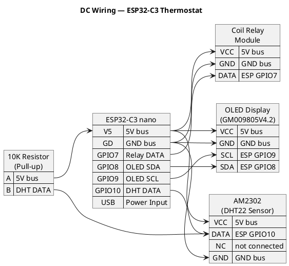
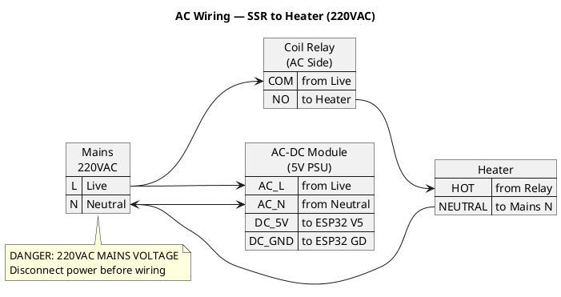

# Thermostat Wiring Diagram

## Components
- ESP32-C3 nano board
- GM009805V4.2 OLED Display (SSD1306, I2C)
- Aosong AM2302 Temperature/Humidity Sensor
- Solid State Relay (SSR) 3-32VDC / 220VAC
- 10KΩ Resistor (pull-up for AM2302)

---

## Board Pinout

| Pin label  | Role     | Alt label |
| ---------- | -------- | --------- |
| Left side  |          |           |
| V5         | 5V input |           |
| GD         | GND      |           |
| V3         | 3V3      |           |
| RX         | GPIO20   | RX        |
| TX         | GPIO21   | TX        |
| 2          | GPIO2    | A2        |
| 1          | GPIO1    | A1        |
| 0          | GPIO0    | A0        |
| Right side |          |           |
| 10         | GPIO10   |           |
| 9          | GPIO9    | SCL       |
| 8          | GPIO8    | SDA       |
| 7          | GPIO7    | SS        |
| 6          | GPIO6    | MOSI      |
| 5          | GPIO5    | MISO      |
| 4          | GPIO4    | A4        |
| 3          | GPIO3    | A3        |

---

## Wiring Diagram

### DC Side — MCU, Sensor, Display, Relay Input

### AC Side — Relay Output to Heater (220VAC)

---

## Connection Tables

### OLED Display (I2C)
| OLED Pin | ESP32-C3 Pin | GPIO  |
|----------|--------------|-------|
| GND      | GD           | -     |
| VCC      | V5 (5V)      | -     |
| SCL      | 9            | GPIO9 |
| SDA      | 8            | GPIO8 |

### AM2302 Temperature Sensor
| AM2302 Pin  | ESP32-C3 Pin | GPIO   | Notes |
|-------------|--------------|--------|-------|
| Pin 1 (VCC) | V5 (5V)      | -      | Power |
| Pin 2 (DATA)| 10           | GPIO10 | + 10KΩ pull-up to 5V |
| Pin 3 (NC)  | -            | -      | Not connected |
| Pin 4 (GND) | GD           | -      | Ground |

### Solid State Relay (SSR)
| SSR Terminal | Connection     |
|--------------|----------------|
| DC+ (input)  | 7 (GPIO7)     |
| DC- (input)  | GD (GND)      |
| AC Load      | Heater in series with mains |

---

## Pin Summary

| Board Pin | GPIO   | Function        |
|-----------|--------|-----------------|
| 9         | GPIO9  | OLED SCL (I2C)  |
| 8         | GPIO8  | OLED SDA (I2C)  |
| 10        | GPIO10 | AM2302 Data     |
| 7         | GPIO7  | SSR Control     |
| V5        | -      | Power (OLED, AM2302) |
| GD        | -      | Common Ground   |

---

## Notes

1. **Pull-up Resistor**: The 10KΩ resistor between AM2302 DATA pin and 5V is required for reliable communication.

2. **SSR Input**: The SSR accepts 3-32VDC, so the 3.3V GPIO output from ESP32-C3 is sufficient to trigger it.

3. **Power**: ESP32-C3 nano can be powered via USB.

4. **I2C Address**: The OLED typically uses address `0x3C`. Run an I2C scanner if display doesn't work.

5. **Pin grouping**: All signal pins (GPIO7-10) are on the right side of the board, minimizing wiring complexity.

---

## Safety Warnings

⚠️ **MAINS VOLTAGE (220VAC)**
- Disconnect power before wiring the AC side
- Use properly rated wires for AC current
- Ensure proper insulation and enclosure
- The SSR should be rated for your heater's current draw
- Consider adding a fuse on the AC side
